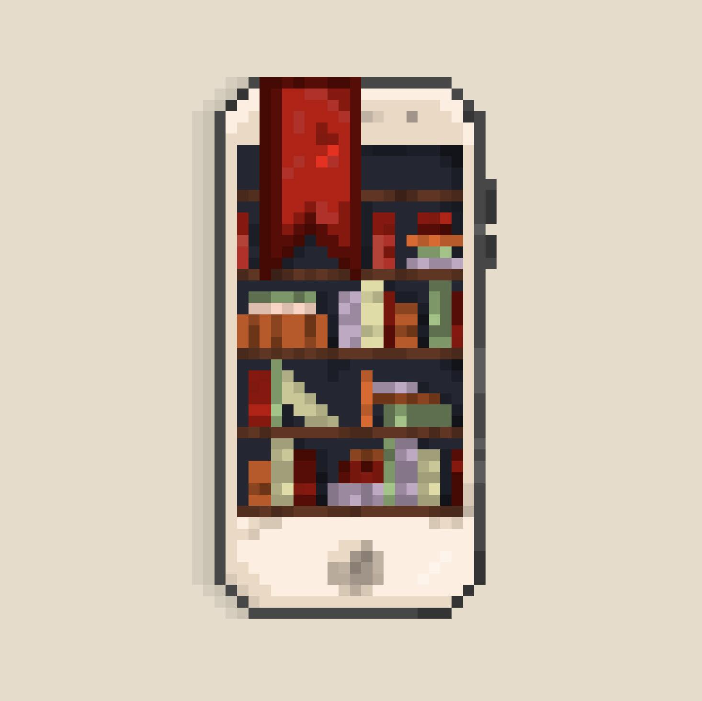

# GoShelf
Simple project for Mobile Aplications class at uni for tracking your home library, written (backend at least) in Golang.

#### Technologies used
* Android Studio
* Tesseract (ocr)
* Postgresdb 
* ZeroTier (vpn - I got no public ip)
* Docker (hell yeah)
* Golang (backend)

Work very much in progress...
