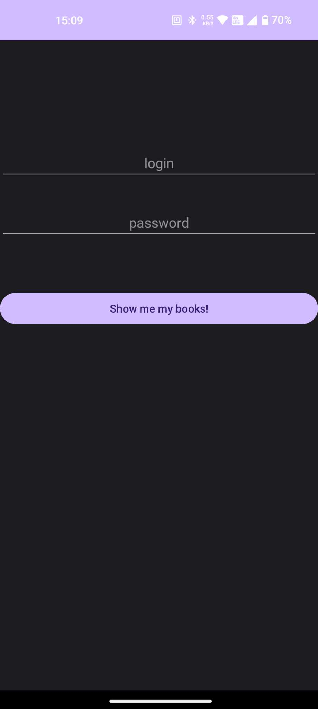
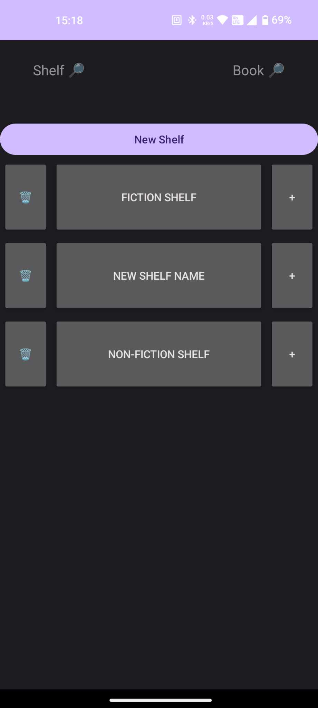
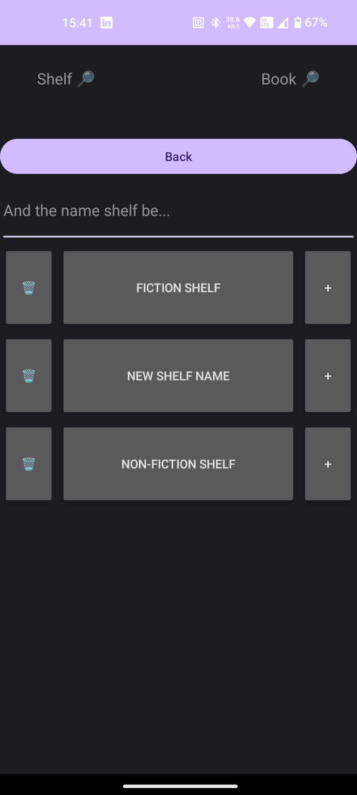
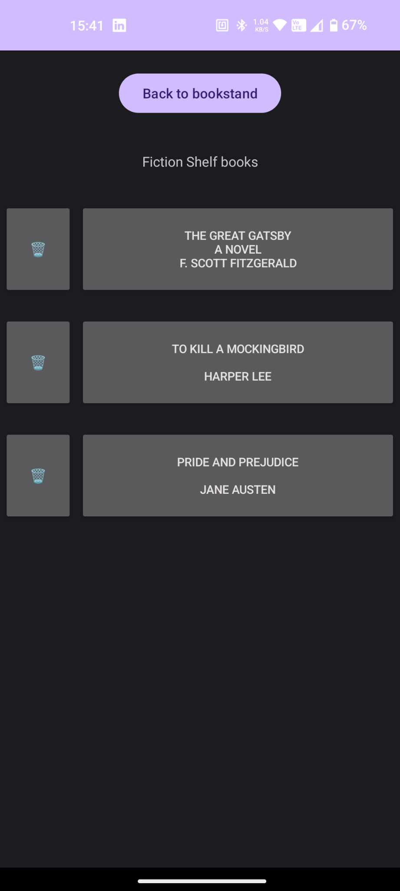
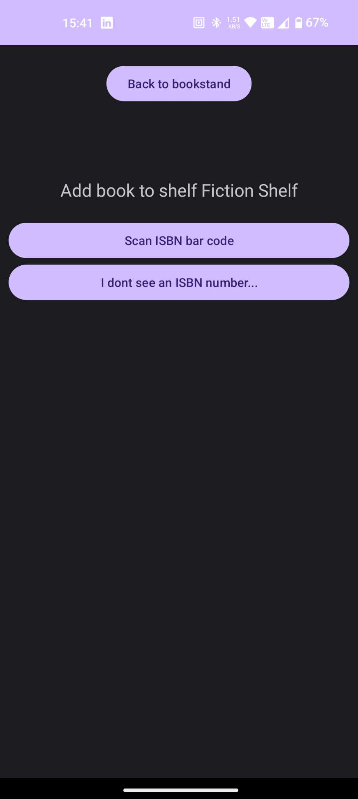
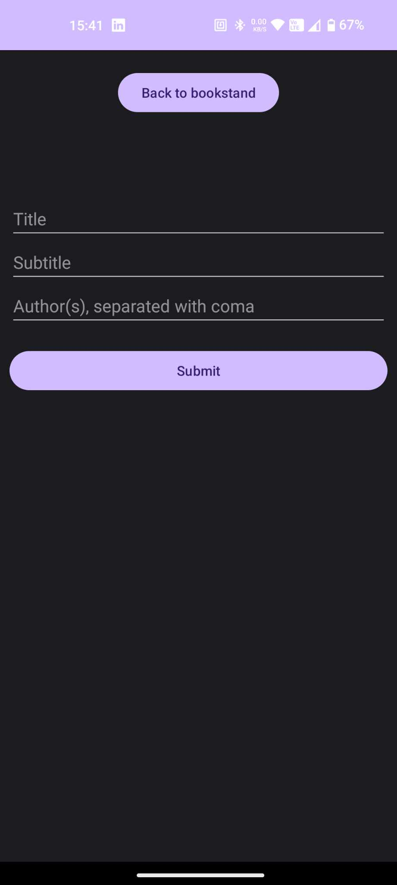
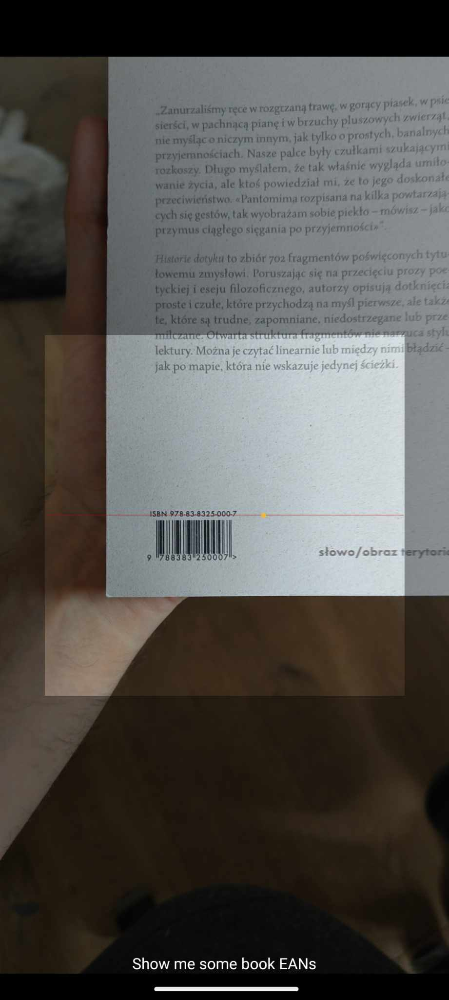

# GoShelf
## Aplikacja mobila do zarządzania domową biblioteką.
Igor Szczepaniak, 151918

### Założenia
Aplikacja stanowi alternatywny sposób zaliczenia laboratorium. Implementuje ona większość funkcjonalności przewidzianych w programie.

Za pomocą aplikacji użytkownik może w łatwy, ustruktuaryzowany sposób dodawać książki do zdalnej bazy danych, dzięki czemu jest w stanie zoptymalizować
proces poszukiwania książki w domowym zaciszu.

### Użyte technologie
Frontend aplikacji został napisanay w `Kotlinie`, w modelu XML, który zarządza zdalną bazą danych `sqlite` poprzez api napisane w `Go`.
Główną funkcjonalnością aplikacji jest możliwość skanowania kodów kreskowych ISBN (za pomocą biblioteki `IntentIntegrator`), które są wyszukiwanie
w bazie danych googla, wystawianą przez darmowe api (https://www.googleapis.com/books/v1/volumes).

### Opis funkcjonalności
#### Ekran logowania
Użytkownik może ropocząć przygodę z *GoShelf* po wprowadzeniu poprawnego loginu oraz hasła. Na danym użądzeniu będzie musiał akcję logowania wykonać 
jedynie raz - podczas udanego logowania w bazie danych zapisywane `androidId` urządzenia,
które jest wykorzystywane jako token autoryzacyjny przy kolejnych logowaniach.



```java
globalAndroidId = Secure.getString(contentResolver, Secure.ANDROID_ID)
```

#### Ekran główny
Ekran głowny składa się z dwóch fragmentów: górny przeznaczony jest do poruszania się po aplikacji, a dolny do wyświetlania treści.
Po zalogowaniu wyświetlana jest aktualna lista półek na książki, znajdujących się w bazie danych, na którą składają się dynamicznie dodawane przyciski.

Korzystająć z górnego panelu, użytkownik ma możliwość wyszukiwania konkretnej książki w bazie danych, bądź całej półki, zarówno jak dodanie nowej lub usunięcie istniejącej półki.





```java
private fun createShelf(view: View, name: String, booksOn: Int, id: String) {
    val scrollView = view.findViewById<ScrollView>(R.id.scrollView)
    val innerLinearLayout = scrollView.findViewById<LinearLayout>(R.id.inner_linear_layout)

    val shelfHeight = 250
    val layoutParams = LinearLayout.LayoutParams(
        LinearLayout.LayoutParams.MATCH_PARENT,
        LinearLayout.LayoutParams.WRAP_CONTENT
    )

    val linearLayout = LinearLayout(requireContext())
    linearLayout.orientation = LinearLayout.HORIZONTAL
    linearLayout.layoutParams = layoutParams

    val addBookBtn = Button(requireContext())
    addBookBtn.text = "+"
    val addParams = LinearLayout.LayoutParams(
        0,
        LinearLayout.LayoutParams.WRAP_CONTENT,
        0.2f
    )
    addParams.setMargins(8, 8, 8, 8)
    addBookBtn.layoutParams = addParams
    addBookBtn.height = shelfHeight

    val delBookBtn = Button(requireContext())
    delBookBtn.text = "\uD83D\uDDD1\uFE0F"
    val delParams = LinearLayout.LayoutParams(
        0,
        LinearLayout.LayoutParams.WRAP_CONTENT,
        0.2f
    )
    delParams.setMargins(8, 8, 8, 8)
    delBookBtn.layoutParams = addParams
    delBookBtn.height = shelfHeight

    val shelfBtn = Button(requireContext())
    shelfBtn.text = name
    val shelfParams = LinearLayout.LayoutParams(
        0,
        LinearLayout.LayoutParams.WRAP_CONTENT,
        0.9f
    )
    shelfParams.setMargins(8, 8, 8, 8)
    shelfBtn.layoutParams = shelfParams
    shelfBtn.height = shelfHeight


    linearLayout.addView(delBookBtn)
    linearLayout.addView(shelfBtn)
    linearLayout.addView(addBookBtn)

    innerLinearLayout.addView(linearLayout)

    val args = Bundle().apply {
        putString("shelfName", name)
        putString("shelfId", id)
    }

    shelfBtn.setOnClickListener {
        activity?.supportFragmentManager?.beginTransaction()?.apply {
            setCustomAnimations(R.anim.enter_right_to_left, R.anim.exit_right_to_left, R.anim.enter_left_to_right, R.anim.exit_left_to_right)
            replace(R.id.fragmentContainerView, BackToMain().apply{})
            replace(R.id.fragment_container, ShelfContent().apply{
                arguments = args
            })
            addToBackStack(null)
            commit()
        }
    }

    addBookBtn.setOnClickListener {
        MainActivity.getInstance().globalTmpShelfId = id
        activity?.supportFragmentManager?.beginTransaction()?.apply {
            setCustomAnimations(R.anim.enter_right_to_left, R.anim.exit_right_to_left, R.anim.enter_left_to_right, R.anim.exit_left_to_right)
            replace(R.id.fragmentContainerView, BackToMain().apply{})
            replace(R.id.fragment_container, PickOne().apply{
                arguments = args
            })
            addToBackStack(null)
            commit()
        }
    }

    delBookBtn.setOnClickListener{
        val builder = AlertDialog.Builder(context)
        builder.setTitle("Delete shelf")
        builder.setMessage("Are you sure you want to delete (disintegrate) shelf $name?")

        builder.setPositiveButton("Confirm") { dialog, _ ->
            httpGet("http://${MainActivity.getInstance().globalServerAddress}/deleteShelf/$id"){}
            Toast.makeText(context, "Shelf $name disintegrated", Toast.LENGTH_SHORT).show()
            activity?.supportFragmentManager?.beginTransaction()?.apply {
                replace(R.id.fragment_container, ShelfList().apply{})
                addToBackStack(null)
                commit()
            }
            dialog.dismiss()
        }

        builder.setNegativeButton("Cancel") { dialog, _ ->
            Toast.makeText(context, "Disintegration cancelled", Toast.LENGTH_SHORT).show()
            dialog.dismiss()
        }

        val dialog = builder.create()
        dialog.show()
    }
}
```

#### Zawartość półki
Po kliknięciu w daną półkę, na ekranie wyświetlane są wszystkie książki znajdujące się na danej półce. Proces wyświetlania książek jest analogiczny do wyświetlania półek.



#### Dodawanie książki
Po naciśnięciu `+` przy danej półce, użytkownik zostaje postawiony przed wyborem, czy książka chce być dodana w sposób ręczny, czy też *automagiczny* (poprzez skanowane kodu kreskowego ISBN).



* W przypadku wybrania metody ręcznej:



* W przypadku wybrania metody *automagicznej*:



```java
private fun startBarcodeScanning() {
    val integrator = IntentIntegrator.forSupportFragment(this)
    integrator.setPrompt("Show me some book EANs")

    integrator.setOrientationLocked(true)
    integrator.setBeepEnabled(true)

    integrator.initiateScan()
}

override fun onActivityResult(requestCode: Int, resultCode: Int, data: Intent?) {
    super.onActivityResult(requestCode, resultCode, data)

    val result: IntentResult? =
        IntentIntegrator.parseActivityResult(requestCode, resultCode, data)
    if (result != null) {
        val barcodeValue = result.contents
        Log.d("BarcodeScanner", "Scanned: $barcodeValue")
        httpGet("https://www.googleapis.com/books/v1/volumes?q=isbn:$barcodeValue") { responseBody ->
            val bookInfo = parseJson(responseBody)
            if (bookInfo != null){
                Log.d("Title",bookInfo.title)
                if (bookInfo.subtitle != null) Log.d("Subtitle",bookInfo.subtitle)
                Log.d("Authors:",bookInfo.authors.toString())
                httpGet("http://${MainActivity.getInstance().globalServerAddress}/addBook/${MainActivity.getInstance().globalTmpShelfId}/${bookInfo.title}/${bookInfo.subtitle}/${bookInfo.authors}"){}
                Toast.makeText(requireContext(), "New book is on the shelf :))", Toast.LENGTH_SHORT).show()

            } else {
                Toast.makeText(requireContext(), "Sorry, I don't recognize this ISBN :((", Toast.LENGTH_SHORT).show()
            }
        }
    } else {
        super.onActivityResult(requestCode, resultCode, data)
    }
}
```

#### Kod żródłowy
Kompletny kod źródłowy frondendu jak i backendu znajduje się na repozytorium [GoShelf](https://github.com/bynajmniejIgnor/GoShelf).